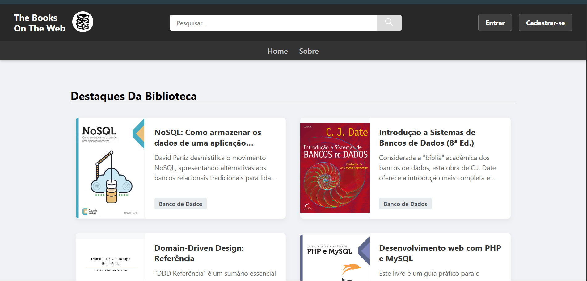

# 📚 The Books On The Web: Catálogo de Livros de TI (UMC)

## 📌 Sobre o Projeto

Este projeto consiste na criação de um **catálogo e acervo digital de livros gratuitos** focados na área de Tecnologia da Informação (TI). O objetivo principal é fornecer aos usuários uma plataforma para **visualizar, buscar e personalizar** o acervo através da funcionalidade de **favoritar títulos**.

## 👥 Contexto e Colaboradores

O projeto foi desenvolvido como requisito acadêmico na **Universidade de Mogi das Cruzes (UMC)**.

* **Integrantes:**
    * Alef Hugo
    * Gustavo Vitor
    * Arthurs
    * Vitor

## 🛠 Tecnologias Utilizadas

A aplicação é construída com uma arquitetura baseada em PHP para o Back-end e JavaScript para o dinamismo do Front-end.

* **Back-end:** **PHP** (via Apache), **MySQL** (Gerenciamento de Dados).
    * Foco em CRUD e proteção de páginas.
* **Front-end:** **JavaScript**
    * Utilização de **AJAX** para comunicação assíncrona com o servidor.

## ⚙️ Arquitetura e Estrutura Principal

Abaixo está a estrutura principal de diretórios, com destaque para a função de cada componente:

<table align="center">
  <thead>
    <tr>
      <th colspan="4" align="center"><a href="The-Books-On-The-Web/public">ESTRUTURA PRINCIPAL DO PROJETO</a></th>
    </tr>
  </thead>
  <tbody>
    <tr>
      <td><a href="The-Books-On-The-Web/public/api">Servidor (api)</a></td>
      <td><a href="The-Books-On-The-Web/public/templates">Modelos Das Paginas (templates)</a></td>
      <td><a href="The-Books-On-The-Web/public/styles">Estilização (Styles)</a></td>
      <td><a href="The-Books-On-The-Web/public/scripts">Scripts do Javascript (scripts)</a></td>
    </tr>
    <tr>
      <td>Responsável pela **comunicação Back-end (PHP/Apache)** com o **MySQL**. Aceita e retorna dados obrigatoriamente via **JSON**.</td>
      <td>Armazena os modelos de páginas do site, sendo subdividido para melhor manutenção.</td>
      <td>Concentra as folhas de estilo e arquivos de imagens da aplicação.</td>
      <td>Contém as **validações primárias** de formulários e inicia as **requisições AJAX** para a API. Também realiza a leitura de arquivos **PDF** para criação das capas dos livros.</td>
    </tr>
  </tbody>
</table>

## ✅ Funcionalidades em Destaque

* **Personalização do Usuário (Favoritos):** Permite que os usuários salvem e gerenciem seus títulos preferidos no acervo (funcionalidade de favoritar/bookmark).
* **Gerenciamento de Conteúdo (CRUD):** O sistema oferece suporte CRUD (Create, Read, Update, Delete) para que os administradores possam gerenciar e manter o **catálogo de livros** atualizado.
* **Comunicação Eficiente (AJAX):** Utilização de JavaScript e AJAX para garantir a **dinamicidade da página** e melhorar a experiência do usuário.
* **Extração de Capas:** Capacidade de ler e processar arquivos **PDF** para gerar e exibir as capas dos livros.
* **Segurança:** Implementação de proteção nas páginas via PHP.

## 🖼️ Demonstração

Se possível, adicione uma captura de tela (screenshot) ou um GIF animado que mostre a aplicação funcionando.

* [Link para a aplicação em funcionamento ](https://github.com/alefHugo03/The-Books-On-The-Web/edit/main/README.md)
* **Captura de Tela da Primeira Pagina:**
     
    *(Obs.: Você precisará adicionar o arquivo `screenshot-principal.png` na pasta `assets` do seu repositório.)*!